# STIK-eNote: A Dual-Display Pocketable Task Tracker


I have ADHD, and I've tried most of the standard productivity systems: apps, timers, alarms, sticky notes, whiteboards. The thing that actually stuck was carrying a physical notebook. Writing things down, having the list right in front of me with no notifications layered on top, no app to open. My productivity went up noticeably once I started doing that, and it kept going up the longer I kept the habit.

Notebooks have their own problems, though. I always forgot a pencil. When I had a lot going on, the space management on the page became its own chore. Keeping things organized across days was a mess. So I started thinking about whether I could build something with the parts of the notebook that worked (dedicated, distraction-free, always showing me what I need to do) while handling the parts paper is bad at.

That's the STIK-eNote. It's a clamshell device about the size of a thick business card wallet. The back face is an ePaper display that always shows the current task list, even with the device closed and asleep. Open the device and a physical QWERTY keyboard and a color TFT come on so you can edit things. Close it again and it goes back to sleep, with the ePaper holding whatever was last pushed to it.

It's still a prototype. The current build is hand-wired on modules, but the PCB is fully designed and the firmware runs end-to-end. This page documents how the whole thing works.

---

## What It Does

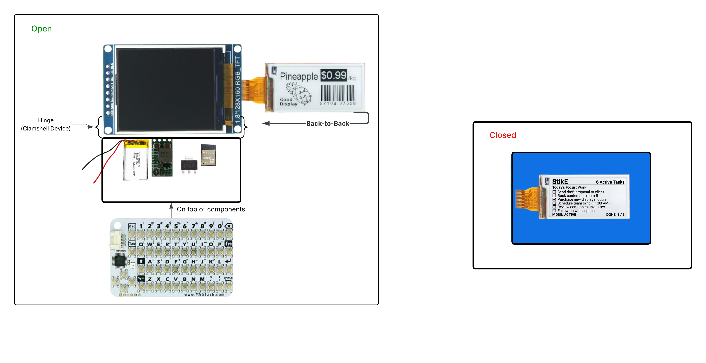
*Assembly diagram showing the open and closed configurations of the STIK-eNote.*

The two displays serve completely different purposes.

The TFT (a 1.8" ST7735S) is the active interface. It handles task editing, the calendar, the pomodoro timer, and settings. Navigation feels snappy because rendering happens out of a sprite buffer (a software framebuffer that holds the full frame in memory before pushing it to the screen in one operation), which avoids the flicker you'd otherwise see writing one element at a time over a slow SPI bus. The TFT is also only ever on while the keyboard is in use, so the battery cost is manageable even though it's a backlit color display.

The ePaper (a 2.13" GDEQ0213B74) is the persistent display. It lives on the back of the device and is on whether or not the rest of the device is awake, which is fine because ePaper holds its image with no power. When the device wakes up, the ePaper cycles through whatever tasks and upcoming events were last pushed to it. Updates are slow because of how electrophoretic ink works, but the ePaper isn't being scrolled through; it's being glanced at.

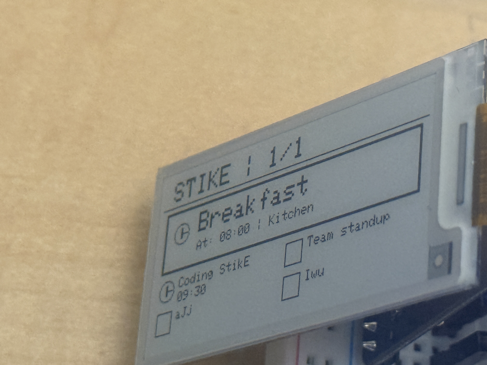
*ePaper showing the sleep display with an upcoming event and active tasks.*

The whole thing is driven by an ESP32-S3 (N16R8 variant), which has two cores and enough headroom to handle display rendering and keyboard polling at the same time without one stalling the other. The N16 stands for 16mb of NOR flash, where we store persistent data. The R8 stands for 8mb of PSRAM where we store actively used data like what is required for the displays (where the display buffer lives as well).

---

## The Screens

### Task List

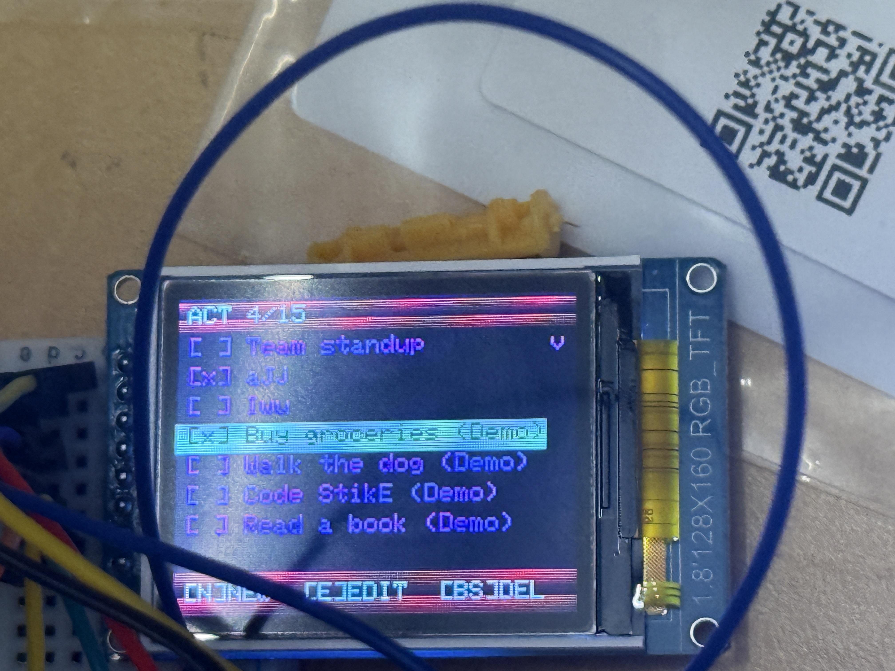
*TFT showing the full task list in active mode.*

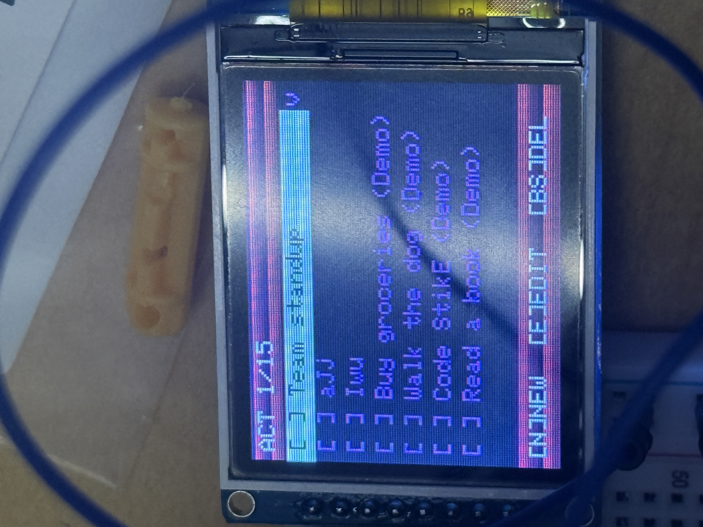
*TFT showing the task list filtered to uncompleted tasks.*

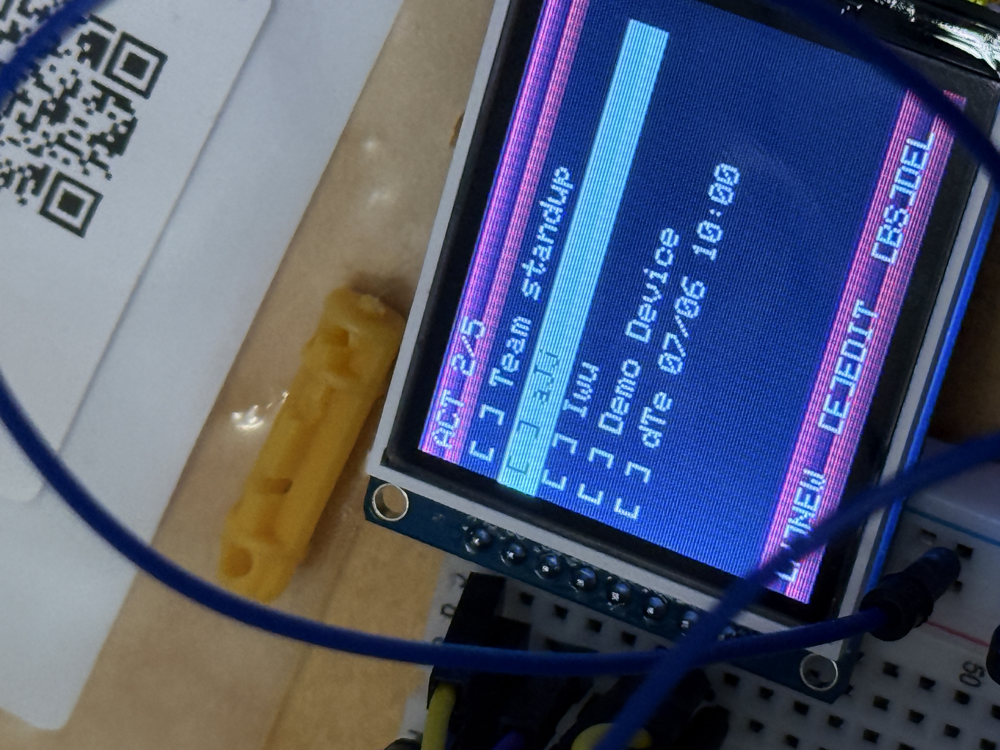
*TFT showing the task list with a due-date task visible.*

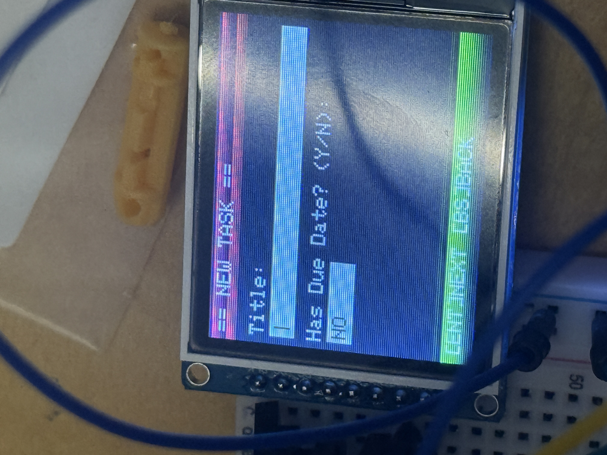
*TFT showing the new task entry form.*

The main view. Tasks show up as a scrollable list with checkboxes, filterable by active, completed, or both. Press `a` to add a task, navigate with the arrow keys, and hit Enter to toggle completion. Tasks are stored in NVS (the ESP32's non-volatile storage) as fixed-size binary blobs, so the list survives a power-off. Capacity is 20 tasks and 50 calendar events, both backed by fixed arrays so there's no dynamic memory allocation on the data path at all.

### Calendar — Month View

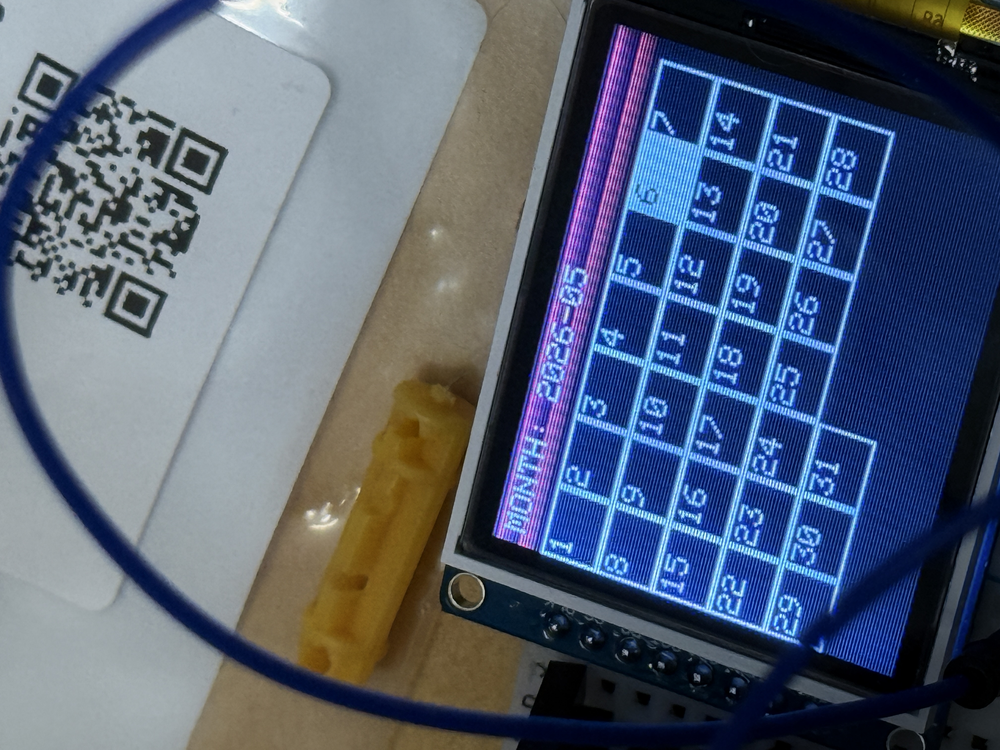
*TFT showing the calendar month grid.*

Press `fn + c` from anywhere to jump into the calendar. Month view shows the full grid, with markers on days that have events. Navigation is the arrow keys.

### Calendar — Week View

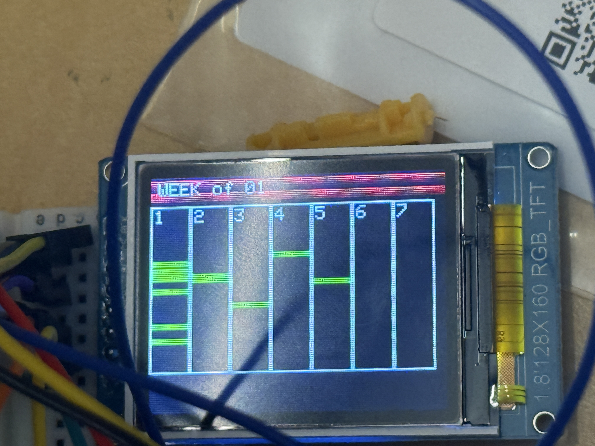
*TFT showing the week view with events marked by day.*

Week view shows the current week with events laid out by day, which is what I usually want when I'm trying to see how the next few days are loaded.

### Calendar — Event View

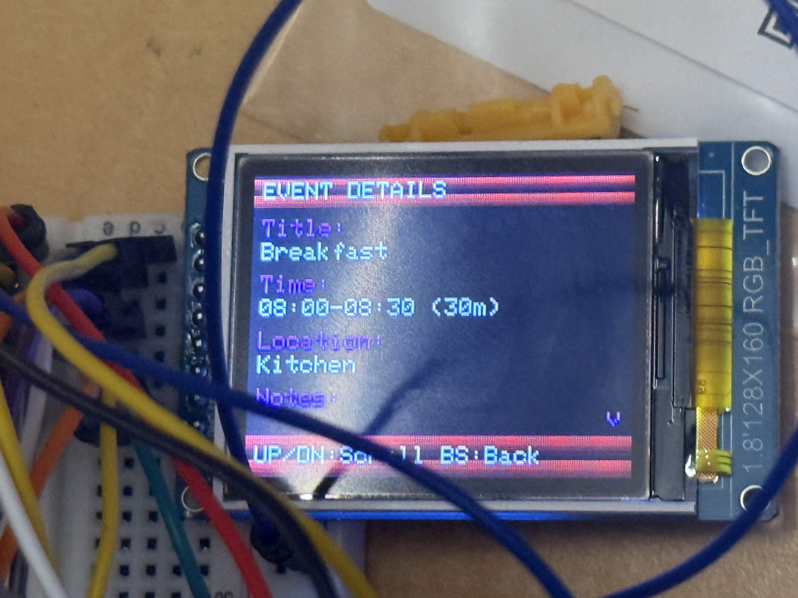
*TFT showing the event details screen.*

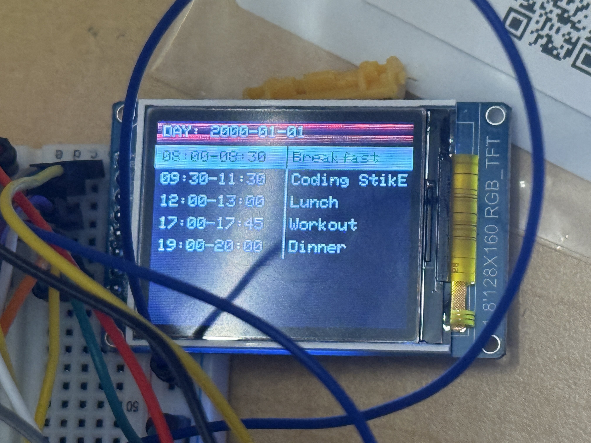
*TFT showing the day view with events listed by time.*

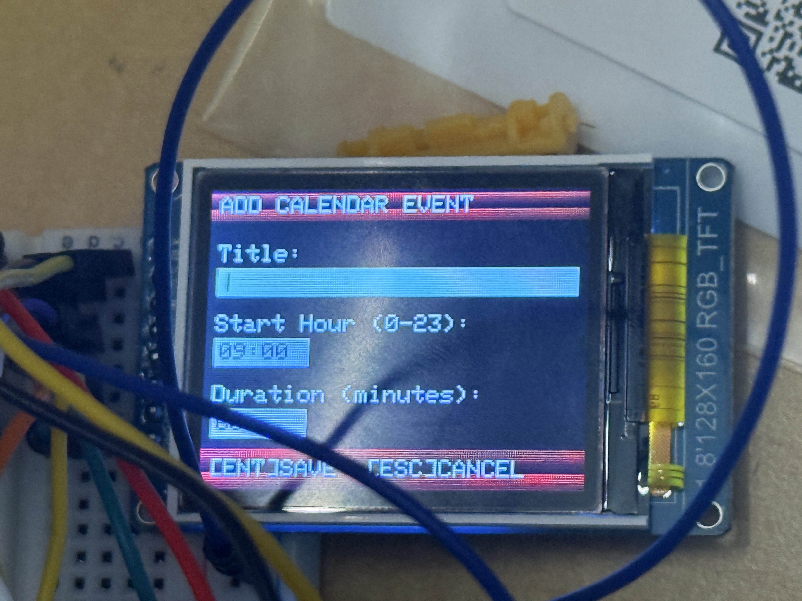
*TFT showing the add calendar event form.*

Drilling into a day or event shows the full details: title, notes, location, time, duration. Events can be linked to tasks, so a scheduled block can point at a specific to-do.

### Pomodoro

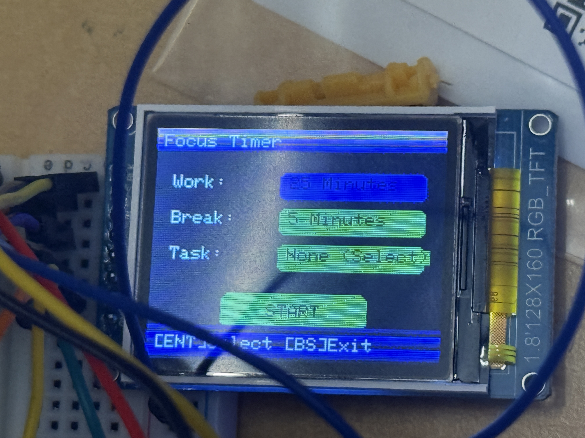
*TFT showing the focus timer setup screen.*

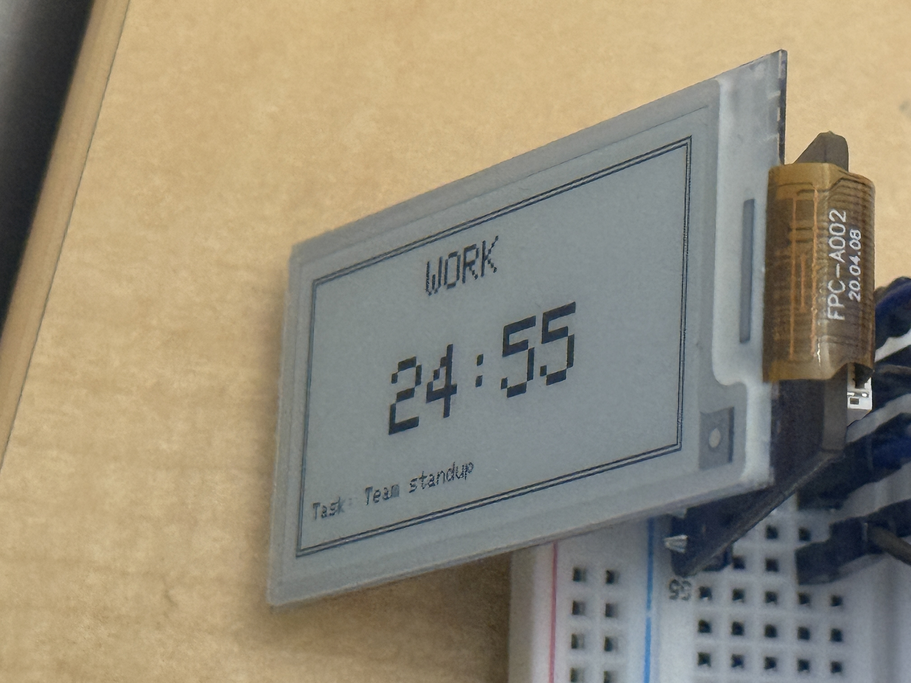
*ePaper showing the pomodoro timer counting down during a work session.*

Press `fn + p` to start a pomodoro session. The timer counts down on screen, and when a session ends the device can push a summary to the ePaper and go back to sleep, so the mid-session context is preserved if I step away from it.

### Settings

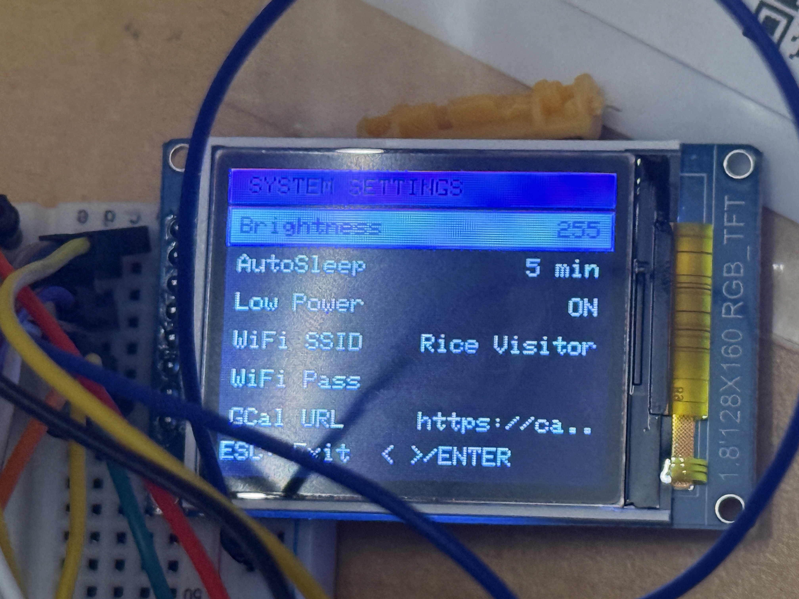
*TFT showing the system settings screen.*

Settings handles display preferences and low-power mode. With low-power mode on, the CPU frequency drops and the FreeRTOS polling delays increase. It isn't a dramatic change in feel, but it does add up over a day of use.

### Sleep Display (ePaper)


*ePaper showing the sleep display cycling through active tasks and an upcoming event.*

The ePaper sleep display cycles through up to ten screens of content (active tasks, upcoming events) using a 10-second sleep cycle. On each wake, the firmware checks which screen is supposed to be next, updates the display if anything has changed, and goes back under. Average power draw across that cycle is very low because the panel itself draws nothing while idle and the ESP32 is only awake briefly. We also prepare the screens themselves before going to sleep so there's no related intensive calculations required while in this low power state.

---

## Software Architecture

The firmware is built with PlatformIO on the Arduino framework, with FreeRTOS handling the dual-core split.

### The Dual-Core Split

Core 0 does one thing: poll the keyboard. It runs a dedicated FreeRTOS task that continuously checks the I2C bus (address `0x5F`, the M5Stack CardKB) for keystrokes. When it finds one, it packages the input into a `SystemEvent` struct and pushes it onto a shared FreeRTOS queue. Core 0 doesn't touch the display or the state machine.

Core 1 runs the main application loop. It blocks on the event queue, processes whatever events arrive, updates the state machine, and triggers rendering. Because keyboard polling and display rendering live on completely separate cores with a queue between them, neither one can stall the other. This mattered in practice; SPI display writes are slow enough that if the keyboard were competing for CPU time on the same core, you would feel it in the input latency.

### The State Machine

Everything in the UI is a state. `STATE_UI_LIST`, `STATE_UI_CALENDAR`, `STATE_SLEEP`, `STATE_EPAPER_UPDATE`, and so on. Transitions go through the event queue: a key press arrives, the current state handler decides what to do with it, and if a transition is needed, the new state gets set and the relevant handler takes over on the next loop tick.

```
Input (Core 0)
    └─► FreeRTOS Queue
            └─► Main Loop (Core 1)
                    ├─► State Handler
                    ├─► State Update
                    └─► DisplayManager.render()
```

### The Display Manager

The `DisplayManager` class handles both screens. For the TFT, it maintains a software sprite (an in-memory framebuffer from the TFT_eSPI library) where all drawing happens before being pushed to hardware in a single operation, which is what removes the flickering you'd otherwise see with a dynamic UI on a slow SPI bus.

The ePaper side is more involved. The display manager filters the active task list and upcoming calendar events, then packs them into `EpaperViewItem` structs, each one representing a single screen of up to six items. On each sleep-cycle wake, it works out which screen to show next and decides whether a partial or full refresh is needed. Full refreshes happen less often because they take several seconds and flash the panel through black-and-white a few times; partial updates are faster but accumulate ghosting if done too many times in a row, so the manager forces a full refresh periodically to clear the buffer.

### Initialization Order

One quirk worth mentioning: the ePaper has to be initialized first, then hibernated, before the TFT gets initialized. Bringing both up at the same time leads to SPI bus contention and both displays end up in an undefined state. The sequencing isn't obvious from the documentation of either library and took a while to figure out.

### Persistence

Tasks and calendar events are serialized to NVS using the ESP32 `Preferences` library. Everything is stored as fixed-size binary blobs from fixed-size arrays (`MAX_TASKS = 20`, `MAX_CALENDAR_EVENTS = 50`), with no dynamic allocation anywhere. On power-on, the main setup routine reads them back out and the device resumes where it left off.

---

## Hardware Design Flow

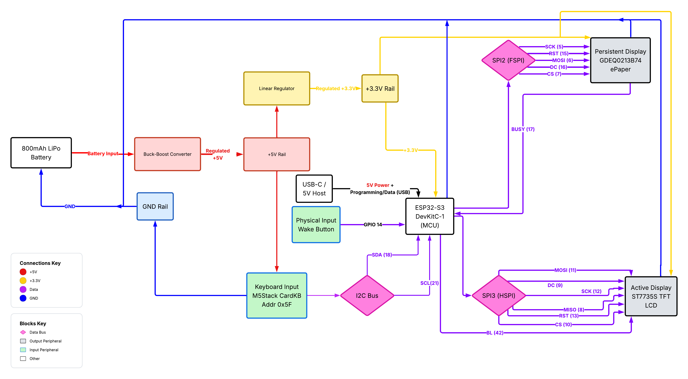
*Electrical block diagram showing the full system architecture.*


*Top-level KiCad schematic showing all subsystems and their interconnections.*

### Power Path


*KiCad schematic showing the power circuitry: battery charging, boost converter, LDO regulator, and lid switch.*


*KiCad schematic showing the USB-C connector and power delivery configuration.*

Power comes from an 800mAh LiPo battery. A TPS613222ADBVR synchronous boost converter steps the battery voltage up to a stable +5V rail, and from there an XC6206P332MR-G LDO drops it down to +3.3V for all the logic-level peripherals. The ESP32, both displays, and the keyboard all run off the 3.3V rail. The boost-then-LDO topology is not the most efficient option (a switching regulator on the 3.3V step-down would waste less power), but both parts have minimal auxiliary component requirements, which kept the BOM short and the board easier to hand-solder on the prototype.

Battery charging is handled by a TPB4056A20-ES1R single-cell linear charger connected to a USB-C input. Two 5.1kΩ CC resistors on the USB-C connector configure it as a 5V sink.

### Display Buses


*KiCad schematic showing the ESP32-S3 pin connections to all peripherals.*

The two displays sit on completely separate SPI buses. The ePaper uses FSPI (SPI2 on the S3, pins 5/6/7/15/16/17). The TFT uses HSPI (SPI3, pins 8/9/10/11/12/13). Keeping them on independent buses wasn't optional. The two libraries used to drive these displays both build on the same underlying graphics infrastructure, and the timing assumptions they make about bus ownership are different enough that sharing a bus caused consistent failures during early bring-up. Splitting the buses fixed it cleanly.

### Wake Circuit

The device wakes from deep sleep via a linear Hall effect switch (DRV5032FADBZR) in the hinge. When the lid opens, the magnet moves away from the sensor and the switch output changes state. An RC differentiator converts the switch's level change into a brief rising-edge pulse, which is what the ESP32's wake pin actually needs. Without the differentiator, the switch output would hold high the entire time the lid was open, which interferes with the auto-sleep behavior; the device is supposed to be able to fall asleep on its own after inactivity, and a wake pin that's already held high prevents that from working cleanly.

### I2C Level Shifting


*KiCad schematic showing the BSS138 bidirectional I2C level shifting circuit.*

The M5Stack CardKB runs at 5V I2C levels, and the ESP32 is a 3.3V part. Two BSS138 N-channel MOSFETs handle the bidirectional level translation on SDA and SCL, with 10kΩ pull-ups on both the low and high sides of each channel. This is a well-known reference circuit for I2C level shifting and works reliably here.

---

## PCB Design

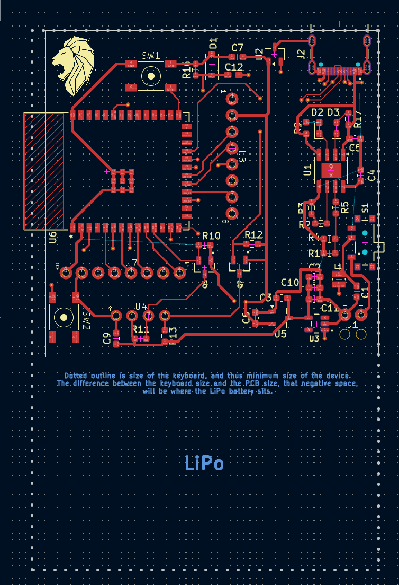
*KiCad PCB front layer showing component placement.*

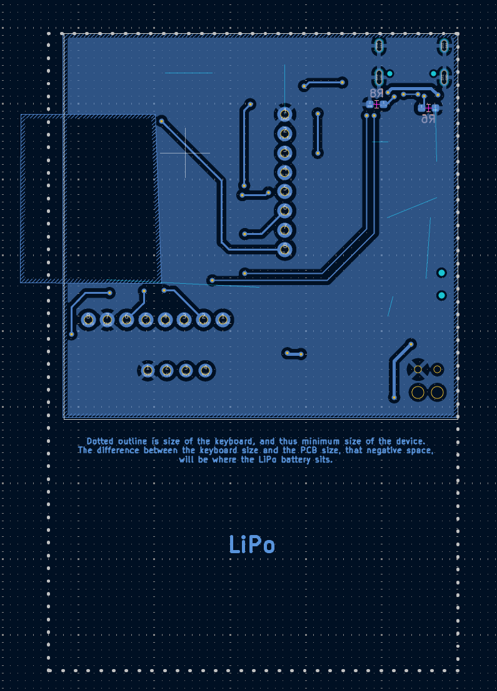
*KiCad PCB back layer showing the ground plane and antenna exclusion zone.*

The PCB is the STIK-eNote V2 design, laid out in KiCad. The board target is 3.5" × 2.0", constrained to that width specifically to leave room alongside it in the chassis for the LiPo, since the keyboard sets the device's overall footprint.

One thing that made the layout interesting: normally with an ESP32, you'd use the configurable GPIO matrix to map the MCU's pins to whatever physical pin order your peripherals expect, and route traces in straight lines. In practice, the combination of the two display libraries, FreeRTOS, and the specific quirks of these particular displays meant that certain pins had to be the default HSPI and FSPI pins with no remapping. So where traces needed to cross, they cross. There are a fair number of vias routing signals up and down between layers to handle that, which is technical debt baked into the copper, but it's debt the software forced the PCB to take on.

The bottom layer is a full ground plane with an exclusion zone cut out around the ESP32 module's antenna end. The module is designed to hang slightly off the board edge, and pouring copper underneath the antenna would detune it, so the keep-out preserves signal integrity in the 2.4GHz band.

Component sizing was chosen with hand soldering in mind. Passives are 0603. The ICs are all standard SOIC or SOT-23 packages. Nothing is 0402 or QFN, because at some point a human has to solder this thing, and that human is me.

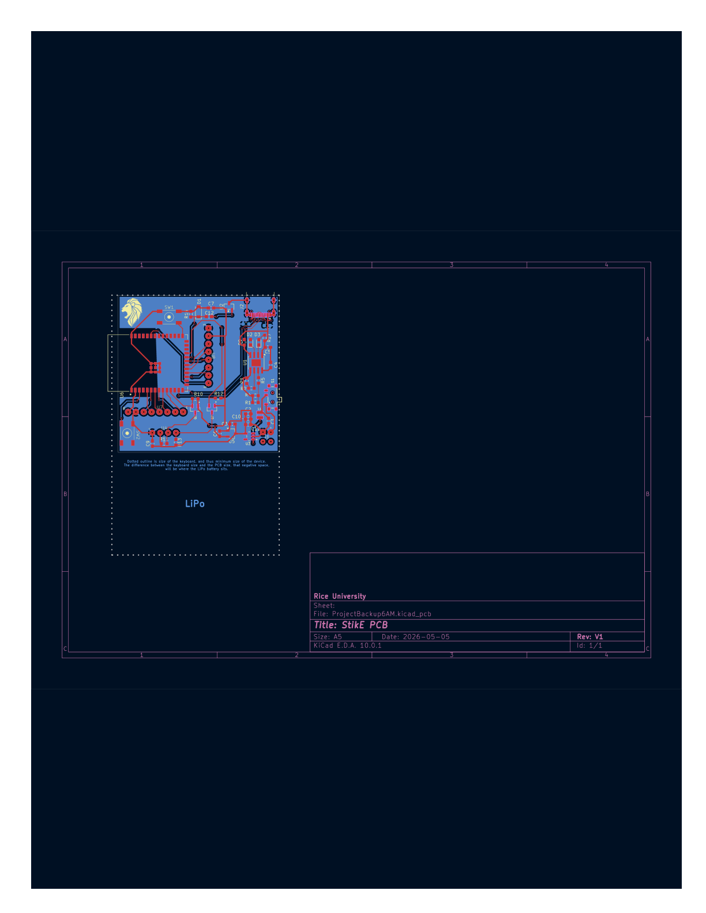
*Full KiCad PCB sheet showing component placement relative to the keyboard footprint and LiPo space.*

### Bill of Materials (Key Components)

| Ref | Part | Function |
|-----|------|----------|
| U6 | ESP32-S3-WROOM-1-N16R8 | Main MCU |
| U3 | TPS613222ADBVR | 5V Boost Converter |
| U5 | XC6206P332MR-G | 3.3V LDO Regulator |
| U1 | TPB4056A20-ES1R | LiPo Battery Charger |
| U2 | DRV5032FADBZR | Hall Effect Lid Switch |
| Q5, Q7 | BSS138 | I2C Level Shifter MOSFETs |
| U_LCD | ST7735S 1.8" TFT | Active Display |
| U_EPD | GDEQ0213B74 | ePaper Persistent Display |
| U_KB | M5Stack CardKB v1.1 | I2C QWERTY Keyboard |
| — | 800mAh LiPo | Battery |

The full BOM with designators, manufacturer part numbers, quantities, and descriptions is in the repository.

---

## Building It

### Software

Requirements: Python 3, PlatformIO CLI.

```bash
# Install PlatformIO
python3 -m pip install -U platformio

# Copy the custom board definition
mkdir -p ~/.platformio/boards && cp esp32-s3-devkitc-1-n16r8v.json ~/.platformio/boards/

# Compile
python3 -m platformio run -e esp32-s3-devkitc-1-n16r8v

# Upload (with hardware attached)
python3 -m platformio run -t upload -e esp32-s3-devkitc-1-n16r8v
```

On first boot, the device initializes both buses in sequence (ePaper first, then TFT), loads any saved tasks and events from NVS, and drops into the task list view. Navigation is arrow keys, Enter to select, `a` to add a task, `c` for calendar, `p` for pomodoro. The device auto-sleeps after inactivity and wakes on any keypress or when the lid opens.

### Hardware

The current prototype is hand-assembled from off-the-shelf modules. PCB files are in the repository for anyone who wants to take it further; gerbers, schematics, BOM, and KiCad project files all live in `project_02/hardware`.

---

## What's Next

The current PCB design works, but it's a first pass at consolidating the prototype. A few things I'd change in the next revision.

The through-hole headers connecting the displays would go. A proper board-to-board connector between the main PCB and a small display adapter board on the hinged upper half would be cleaner and more durable than the current ribbon of wires running through the hinge, which is acceptable on a prototype but not on something you'd want to carry around daily.

The displays themselves don't quite match the keyboard's footprint. The TFT is close, but the ePaper is noticeably narrower than the keyboard below it. A future version would use displays sized to match. The ePaper in particular has a lot of room to grow without changing the physical concept at all.

On the power side, replacing the linear 3.3V regulator with a buck converter would help battery life, especially since the ESP32 draws enough current that the LDO dissipates a meaningful amount of heat at full load. It wasn't worth the PCB complexity for this design pass, but it would be worth it for a polished version.

---

## Repository

All firmware, KiCad files, schematics, gerbers, and BOM are on GitHub.

https://github.com/BeckettMazeau/EDES301

---

*Built at Rice University, Spring 2026. EDES 301.*
